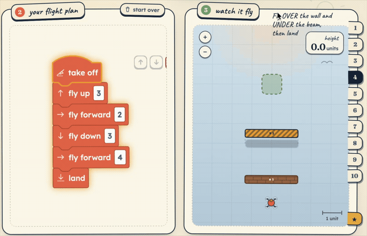

# 🚁 Drone Lab

**A free, no-account, no-ads coding game that teaches young kids (≈5–7) to program — by flying a drone.**

Kids snap together friendly picture-blocks; the app turns them into real Python and flies a drone through little challenges. It starts in an in-browser simulator and is built to fly a real **Bitcraze Crazyflie 2.1+** when you have one — the same blocks, the same code.

### ▶ [**Play it now → thibaud-gh.github.io/drone-lab**](https://thibaud-gh.github.io/drone-lab/)

No install, no sign-up, nothing to download. It runs entirely in your browser.

---

## Why this exists

I'm building this **with my daughter** on Saturday mornings to teach her to code. The drone is just the fun part — the real goal is the "I wrote that, and it *did* something!" moment. It'll always be free, with no ads and no account. If other families enjoy it too, that's more than enough.

We built our own app because the standard block-coding tools for drones can only fly fixed routes — they have no way to *react* to the world. Drone Lab adds **sensor blocks** ("fly until you reach a wall"), which is where the genuinely interesting programming begins.

## What kids learn

The levels add **one idea at a time**, and crashes are funny, not failures:

1. **Move & land** — code makes the drone go.
2. **Turning** — directions and sequence.
3. **Pick up & deliver** — keeping track of a goal.
4. **Over & under** — flying in 3D.
5. **Escape the walls** — combining skills.
6. **Many paths** — there's more than one right answer.
7–8. **Loops** — "do the same thing again and again."
9–10. **Sensors** — the drone *reacts*: fly until it senses a wall.
… plus a **sandbox** to invent your own flights.

A drawer quietly shows the **real Python** the blocks generate, growing alongside what the kid builds — so the jump from blocks to text feels natural when they're ready.

## For grown-ups / tinkerers

- Plain HTML/CSS/JS, **no build step** — open `crazyflie-blockly/frontend/index.html` or serve it with `python3 -m http.server`.
- The browser runs a local simulator; a small Python bridge (`crazyflie-blockly/bridge/`) will fly a real Crazyflie over `cflib` when the hardware's connected.
- Architecture, design decisions, and how to extend it: [CLAUDE.md](CLAUDE.md).
- Local dev setup (macOS): [SETUP.md](SETUP.md).

## Hardware (optional)

The simulator needs nothing. To fly for real later: a **Crazyflie 2.1+** with a **Flow Deck v2** (position hold) and a **Multi-ranger deck** (distance sensors), driven from a **Crazyradio 2.0** dongle.

---

*Made with love, for a happy Saturday. 🛸*
